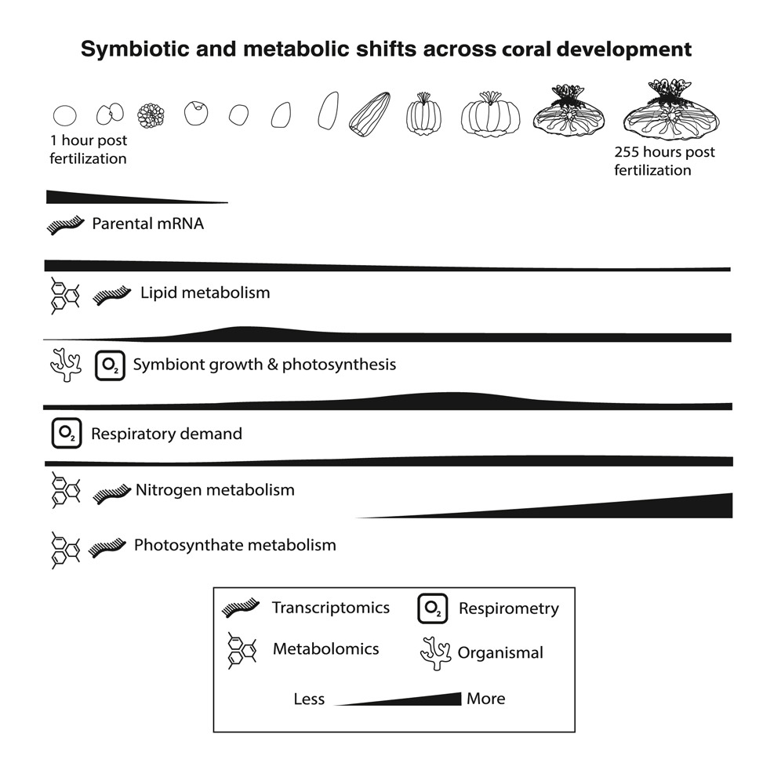
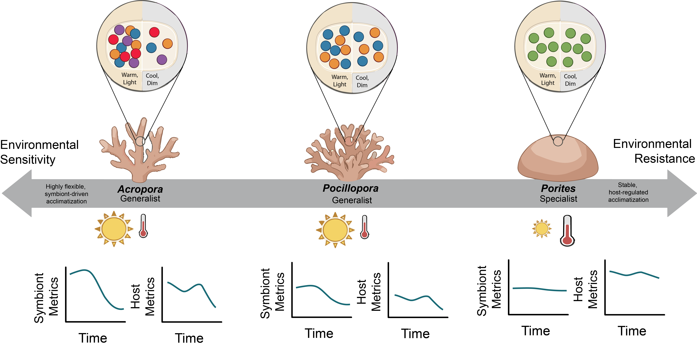
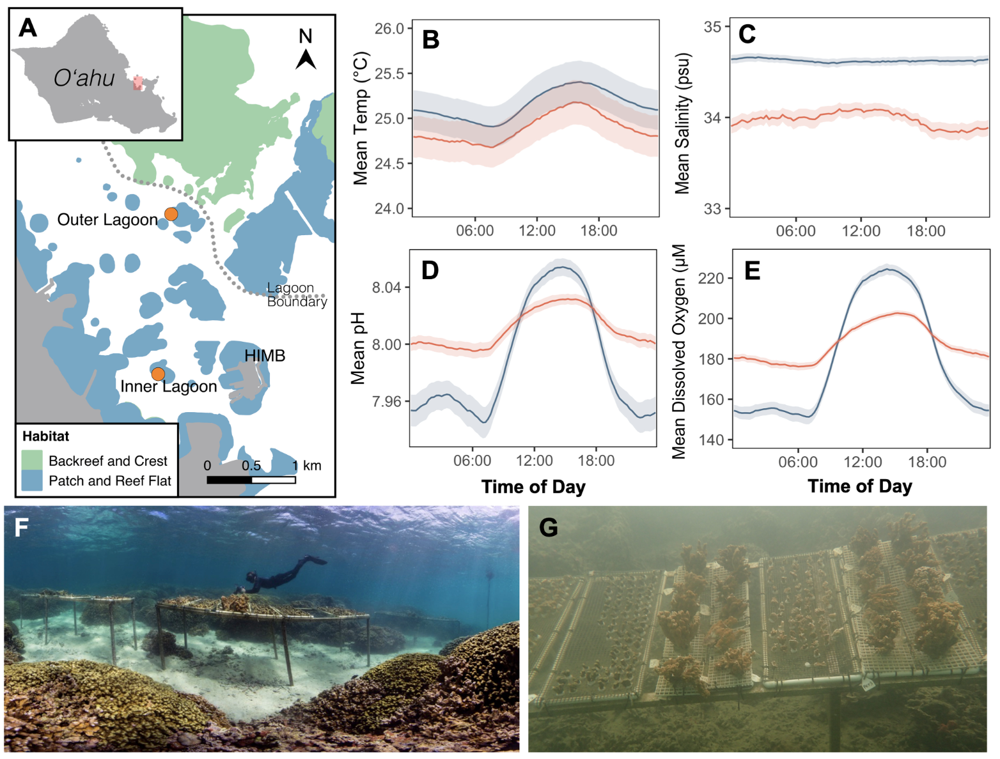

::: {.content-card}
##### Resilience is a team effort

My research focuses on the holobiont (i.e., the host organism and its microbial and symbiotic partners) as the functional unit of performance stress tolerance. Shifts in symbiont communities and metabolic interactions fundamentally shape how marine invertebrates respond to environmental stressors across life stages and environments. By examining corals, sea anemones, and mussels across natural environmental gradients, I aim to understand how flexible partnerships help organisms cope with rapidly changing conditions. Understanding how symbiotic partnerships respond to stress improves our ability to predict when ecosystems will remain stable and when they may cross ecological tipping points.
::: 

::: {.content-card}
### Symbiosis across coral development 

**Project:** Shifts and critical periods in coral metabolism reveal energetic vulnerability during development

 

**Overview:** Symbiotic interactions shape metabolism and performance across development in corals. In this project, we used integrative and multi-omic methods to examine shifts in symbiosis and metabolism across coral early life history.  

**Research Summary:**  

In this work, we examined how coral early life stages shift their energy sources as they grow, moving from relying on nutrients provided by their parents to depending on their symbiotic algae for fuel. By tracking coral development from fertilization through settlement, we found that metamorphosis is an especially energy-intensive and vulnerable stage, where disruptions to symbiosis could strongly reduce survival. These findings help explain why early life stages are so sensitive to climate stress and improve our ability to predict coral recruitment and reef recovery in a warming ocean. 

**Citation:** 

Huffmyer AS, KH Wong, DM Becker, E Strand, T Mass, HM Putnam. 2025. Shifts and critical periods in coral metabolism reveal energetic vulnerability during development. Current Biology 35: 2858-2871. 

**Funding and collaborations:** 

- Collaborators: Coral Resilience Lab (Hawaii Institute of Marine Biology), Hollie Putnam & Putnam Lab (University of Rhode Island), Tali Mass (University of Haifa)
- Funding: National Science Foundation Ocean Sciences Postdoctoral Fellowship, University of Washington eScience Data Science Fellowship, National Science Foundation Rules of Life - Epigenetics Award 

**Links and Information:**

- Read this publication in [Current Biology here.](https://www.cell.com/current-biology/abstract/S0960-9822(25)00588-3)
- Learn more about this project and view the data and code on [GitHub here!](https://github.com/AHuffmyer/EarlyLifeHistory_Energetics)
:::

::: {.content-card}
### Seasonal plasticity in coral symbiosis

**Project:**  Seasonal Physiological Strategies Reveal Contrasting Host–Symbiont Dynamics Among Dominant Indo-Pacific Reef-Building Corals

 

**Overview:** Collaborative research in the [E5 Coral project](https://e5coral.org/) to predict phenotypic and eco-evolutionary consequences of environmental energetic epigenetic linkages. 

**Research Summary:**  

As coral reefs face declines driven by thermal stress and the breakdown of coral symbiosis (i.e., coral bleaching), restoration efforts rely on coral health and resilience rankings. However, seasonal plasticity in symbiosis and metabolism and the presence of cryptic species complicates data interpretation. Quantifying seasonal plasticity in coral physiology and incorporating genetic identification are essential for interpreting and drawing conclusions from trait-based and fitness-based analyses. To test the effect of seasonal and site variation on physiology, we sampled three ecologically dominant genera, *Acropora*, *Pocillopora*, and *Porites* across three lagoon sites (n=15 tagged colonies genus−1 site−1) on the north shore of Moʻorea, French Polynesia in January, March, September, and December of 2020. We identified coral host and intracellular Symbiodiniaceae to the highest taxonomic resolution possible and quantified 13 physiological variables. Genetic analyses identified *A. pulchra* and cryptic lineages in *Pocillopora* (*P. meandrina, P. tuahiniensis*) and *Porites* (*P. evermanni, P. lobata/lutea*). *Acropora pulchra* hosted *Durusdinium trenchii* and *Symbiodinium microadriaticum*. Symbiont communities differed between cryptic congeners, with *P. meandrina* hosting *Cladocopium latusorum* and *P. tuahiniensis* hosting *Cladocopium pacificum*, whereas *P. evermanni* and *P. lobata/lutea* both hosted *Cladocopium* (C15), but each with unique C15 profiles. *Acropora* and *Pocillopora* displayed seasonal cycles of symbiont density and productivity (“boom and bust”) in association with light and temperature, a pattern that may contribute to the greater environmental sensitivity previously reported in these taxa. In contrast, *Porites* exhibited greater symbiont stability, with temperature—rather than light—showing stronger associations with host physiology. Increased host biomass under cooler conditions, which may provide greater energy reserves, could represent one mechanism contributing to the comparatively greater stress tolerance observed in massive *Porites*. Collectively, our findings highlight the importance of integrating baseline physiological measurements with host and symbiont genetics when interpreting coral responses across seasons.

**Citation:** 

Huffmyer AS, et al. 2026. Seasonal Physiological Strategies Reveal Contrasting Host–Symbiont Dynamics Among Dominant Indo-Pacific Reef-Building Corals. *Ecology and Evolution* 16:e74044. [Read here.](https://onlinelibrary.wiley.com/doi/10.1002/ece3.74044)

**Funding and collaborations:** 

- Collaborators: [E5 Coral Network](https://e5coral.org/)
- Funding: National Science Foundation Rules of Life - Epigenetics Award 

**Links and Information:**

- Learn more about the [E5 Coral project here!](https://e5coral.org/)
- Explore data and code [on GitHub here.](https://github.com/urol-e5/timeseries)
:::

::: {.content-card}
### Coral thermal tolerance under variable environments 

**Project:** Collaborative research: Coral bleaching response is unaltered following acclimatization to reefs with distinct environmental conditions

 

**Overview:** Collaborative research with the [Coral Resilience Lab](https://www.coralresiliencelab.com/) to understand the capacity for corals to resist bleaching and survive in variable environments. 

**Research Summary:**  

In this study, we found that moving heat-resistant corals to new reef environments did not weaken their ability to withstand bleaching stressors. Instead, transplanted corals rapidly adjusted their growth and metabolism to local conditions - sometimes performing better than native corals. These results provided  evidence that outplanting stress-tolerant corals can be a safe and effective tool for supporting reef resilience in a warming ocean. 

**Citation:** 

Barott KL, AS Huffmyer, J Davidson, EA Lenz, SB Matsuda, J Hancock, T Innis, B Glazer, C Drury, H Putnam, RD Gates. 2021. Coral bleaching response is unaltered following acclimatization to reefs with distinct environmental conditions. PNAS 118: e2025435118

**Collaborations:** 

- Collaborators: Coral Resilience Lab (Hawaii Institute of Marine Biology)

**Links and Information:**

- Read this publication in [PNAS  here.](https://www.pnas.org/doi/10.1073/pnas.2025435118)
:::

::: {.content-card}
### Related Publications 

**Huffmyer AS**, et al. 2026. Seasonal Physiological Strategies Reveal Contrasting Host–Symbiont Dynamics Among Dominant Indo-Pacific Reef-Building Corals. *Ecology and Evolution* 16:e74044. [Read here.](https://onlinelibrary.wiley.com/doi/10.1002/ece3.74044)

Ashey J, JA Rodriquez-Casariego, KM Durkin, Z Bengtsson, **AS Huffmyer**, SJ White, DM Becker, JM Eirin-Lopez, HM Putnam, S Roberts. 2026. Characterization of long non-coding RNAs, microRNAs, and piwiRNAs in reef building corals. *Environmental Epigenetics* dvag021. [Read here.](https://doi.org/10.1093/eep/dvag021) 

Gorman LM, **AS Huffmyer**, M Byrne, SC Mills, HM Putnam. Coral venom and toxins as protection against crown-of-thorns sea star attack. *Molecular Ecology* 35:e70202. [Read here.](https://doi.org/10.1111/mec.70202) 

**Huffmyer AS**, KH Wong, DM Becker, E Strand, T Mass, HM Putnam. 2025. Shifts and critical periods in coral metabolism reveal energetic vulnerability during development. *Current Biology* 35: 2858-2871. [Read here.](https://doi.org/10.1016/j.cub.2025.05.013) 

Chiles EN, **AS Huffmyer**, C Drury, HM Putnam, D Bhattacharya, X Su. 2023. Stable isotope tracing reveals compartmentalized nitrogen assimilation in scleractinian corals. *Frontiers in Marine Science* 9: 1035523. [Read here.](https://doi.org/10.3389/fmars.2022.1035523)  

Barott KL, **AS Huffmyer**, J Davidson, EA Lenz, SB Matsuda, J Hancock, T Innis, B Glazer, C Drury, H Putnam, RD Gates. 2021. Coral bleaching response is unaltered following acclimatization to reefs with distinct environmental conditions. *PNAS* 118: e2025435118. [Read here.](https://doi.org/10.1073/pnas.2025435118) 

Innis T, L Allen-Waller, KT Brown, W Sparagon, C Carlson, E Kruse, **AS Huffmyer**, CE Nelson, HM Putnam, KL Barott. 2021. Marine heatwaves depress metabolic activity and impair cellular acid-base homeostasis in reef-building corals regardless of bleaching susceptibility. *Global Change Biology* 27: 2728-2743. [Read here.](https://doi.org/10.1111/gcb.15622) 

Matsuda S, **AS Huffmyer**, EA Lenz, J Davidson, J Hancock, A Przybylowski, T Innis, RD Gates, KL Barott. 2020. Coral bleaching susceptibility is predictive of subsequent mortality within but not between coral species. *Frontiers in Ecology and Evolution* 8:178. [Read here.](https://doi.org/10.3389/fevo.2020.00178) 

:::
